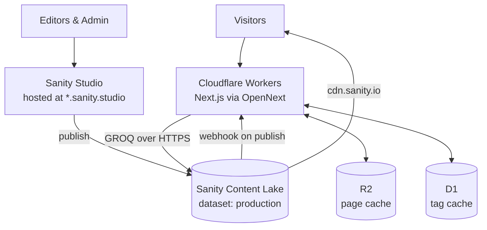

# Architecture

**Project:** Rizal Center of Chicago Website
**Purpose:** Record *why* the technology looks the way it does, so a future contributor can understand the reasoning rather than reverse-engineer it.

## How to read this

| Document | Answers |
| --- | --- |
| [prd.md](prd.md) | What we're building and for whom |
| [epics.md](epics.md) | In what order |
| **architecture.md** *(this file)* | **Why the technology is what it is** |
| `_bmad-output/planning-artifacts/architecture/…/ARCHITECTURE-SPINE.md` | The rules you must not violate |

This document explains and persuades. The spine states invariants tersely and without justification. When the two appear to disagree, **the spine wins** — it's the contract; this is the commentary.

---

## 1. Philosophy

The Rizal Center is a volunteer-run nonprofit. The website has to survive stretches with nobody tending it, and be picked up years from now by someone who wasn't here for any of these decisions.

So we prefer technology that:

- Reduces long-term maintenance over technology that maximizes capability
- Is widely adopted, well documented, and boring
- Solves a problem we actually have

The guiding rule, unchanged from v1 of this document:

> **Every new piece of infrastructure should solve a concrete product problem the current architecture cannot reasonably solve.**

### The scarce resource is attention, not money

This is the correction that most shaped the current design.

The project's operating cost is **$0/month**, and it will stay there. Every quota below has ten to a hundred times the headroom this site needs, and every Cloudflare primitive we use sits inside a free tier. Cost is therefore *not* a useful axis for deciding anything.

What **is** scarce is developer attention — one part-time person — and a volunteer's ability to keep the site running without that person. Every trade-off in this document is priced in **moving parts and silent failure modes**, not dollars.

The corollary, borrowed from [prd.md](prd.md) §18: **design for the untended case.** A component that works perfectly while someone is watching and fails silently when nobody is, is worse than a simpler component that degrades visibly.

---

## 2. The cost envelope

Verified 2026-08-29. Recorded because "it's free" is only useful if you know where the wall is.

| Resource | Included | Notes |
| --- | --- | --- |
| Sanity API requests | 250K/mo | Uncached (`api.sanity.io`) |
| Sanity API CDN requests | 1M/mo | `apicdn.sanity.io` |
| Sanity bandwidth | 100 GB/mo | Includes image delivery |
| Sanity asset storage | 100 GB | |
| Sanity documents | 25K | |
| Sanity datasets | 3 | Growth's 2, +1 for nonprofits |
| Sanity users | 25 | Then $15/user |
| Studio hosting | Free, all plans | `*.sanity.studio` |
| Cloudflare Workers | 100K req/**day**, 10ms CPU | Paid: $5/mo, 10M req/mo, 30s CPU |
| Cloudflare R2 | 10 GB, 1M Class A, 10M Class B ops | Egress free |
| Cloudflare D1 | Free tier | Tag cache only |
| Cloudflare Cron Triggers | 3 per Worker | No separate charge |

**The one real hazard:** add-ons are not available on the Sanity nonprofit plan, and overages require a credit card on file. The failure mode isn't a surprise bill — it's a hard stop. We are nowhere near it, but that's the wall.

Quotas are counted **per project**, not per dataset. A development dataset consumes the same allowance as production.

---

## 3. System shape

Two applications, two hosts, no shared build pipeline:

- **`frontend/rizal-app`** — Next.js, deployed to Cloudflare Workers
- **`studio/rizal-website-redesign`** — Sanity Studio, deployed to Sanity's own hosting

There is no application backend and no relational database. That's a position, not an omission — see §8.

---

## 4. Frontend

**Next.js 16.2.11 · React 19.1.7 · TypeScript 5.7.4 · Tailwind v4**, deployed to **Cloudflare Workers** via `@opennextjs/cloudflare` 1.19.9.

### Why Next.js

Server-side rendering and static generation for SEO, React Server Components, file-based routing, a very large ecosystem, and long-term industry support. Sanity's own documentation and examples target Next.js first.

Decisively: the maintainer already knows React and Next.js well. On a solo, part-time, deadline-bound project, familiarity *is* an architectural property.

### Why not Astro

Astro was seriously considered and is genuinely better at pure static content sites with minimal JavaScript.

The long-term vision isn't a marketing site. Event calendars, search, RSVP, and administrative tooling are all on the roadmap, and each would arrive in Astro as another React island. At some point most of the application is React anyway, with an extra abstraction in the way.

### Why not Remix, SvelteKit, or Nuxt

Remix has an elegant data model but a smaller community and far fewer Sanity examples. SvelteKit performs beautifully but nobody here writes Svelte. Nuxt is Vue; the project is standardized on React.

None of these are bad. They're all less boring *for this team*.

### Why Cloudflare Workers, and not Pages

Workers is the deployment target — `wrangler.jsonc` points at `.open-next/worker.js`. This is worth stating because Pages is the more commonly assumed Cloudflare target and the two behave differently.

Cloudflare gives us global edge delivery, a free tier that comfortably covers this site, no servers to patch, and an expansion path (D1, R2, Cron Triggers, Email Routing) we can adopt one piece at a time.

The OpenNext adapter is what makes Next.js run there. It is well maintained and supports all Next.js 16 minors, but it is a *layer*, and layers have edges — see §11.

---

## 5. Content management

### Why Sanity

The site is a content platform, not a set of pages. Sanity stores structured documents that can be projected into many presentations — which is the mechanism behind [prd.md](prd.md) G3, "a foundation that supports future community tools without redesign."

Concretely, it gives us: structured content modelling, Portable Text, references between documents, an image CDN with on-the-fly transformations, GROQ, and a genuinely good editing experience for non-technical volunteers.

### Why not WordPress

WordPress is a capable CMS and it currently does the job. What it doesn't do well for this project's trajectory: plugin maintenance and security patching (real work for volunteers), tight coupling between content and presentation, and limited content modelling.

Note carefully what we are **not** claiming. [prd.md](prd.md) §2.3 is explicit that *"volunteers being unable to manage content"* is **not** a problem we're solving — WordPress already solves it. It's a **constraint to preserve**. The bar for the editorial experience is *match WordPress*, not beat it.

### Datasets

A dataset is a namespaced collection of documents **and their assets** — an isolation boundary, not a storage category. Images, PDFs, and documents all live together in one.

We have three. They're allocated:

1. **`production`** — the real one. The prototype is built here.
2. **Development** — schema experiments, so iteration can't corrupt migrated content.
3. Spare.

**The prototype is built in the dataset that will become production.** [T1 migration](epics.md) is roughly a week of hand-curated work, chosen specifically to fill Topic pages. Doing that in a throwaway dataset means redoing or exporting it at exactly the moment a go-ahead arrives. Extra datasets cost $999/month, so three is a hard ceiling.

**Sequencing consequence:** E1's field renames (`eventTitle` → `title` and friends) must land **before** T1 writes any content. Renaming a field does not rewrite existing documents. [epics.md](epics.md) already sequences this correctly — E1 in weeks 1–2, T1 from week 3 — and this is why that order is load-bearing rather than incidental.

**Security note:** assets are never private. Even in a private dataset, uploaded files are publicly fetchable by URL. A private dataset protects documents, not images.

### What the nonprofit plan includes that's worth using

The nonprofit plan mirrors Growth, free. Beyond the quotas in §2:

- **Image CDN with on-the-fly transformations** — width, height, `fm=webp`, `auto=format`, quality, hotspot-aware cropping. A large part of the performance story, free. See §7.
- **Scheduled publishing** — write Sunday's closure notice on Thursday. Genuinely useful for volunteers, and it gives announcements currency without the expiry field [prd.md](prd.md) §10.1 rejects.
- **Comments** — editorial collaboration for the three-person team.
- **Multiple user roles** — available, and deliberately unused. §6.2 of the PRD chooses convention over enforcement at three people. Worth knowing it's a settings change if that ever needs teeth.
- **AI Assist** — 100 credits/month across all plans, roughly 50 actions. Enough for the PRD's AI-drafted alt text, but **not unlimited**: drafting alt text for T1's ~50 migrated posts would consume a month's credits in one sitting.

**Not available:** Content Releases (coordinated multi-document publishing) is Enterprise-only. Don't plan around it.

---

## 6. The read path

This is the most consequential section, and the one entirely absent from v1 of this document.

### The problem

The community pulse ([prd.md](prd.md) §7) sorts items by **proximity to today**. It reorders itself as time passes, even when nobody publishes — which the PRD identifies, correctly, as a feature: the homepage visibly changes with zero volunteer effort.

That makes the homepage a **time-dependent** query. The standard headless-CMS recipe — cache everything, invalidate on publish — freezes it. A page that only rebuilds when someone publishes stops reordering, and stops looking alive during exactly the quiet stretches the design exists to survive.

### The resolution: cache the fetch, compute the view

Two things are happening, and they have different natures:

| | Cost | Changes when |
| --- | --- | --- |
| **The data** — which documents exist, their fields | Expensive (network round trip) | Someone publishes |
| **The view** — sort, window, recurrence collapse, labels | Free (array manipulation) | Constantly |

So: **cache the fetch, compute the view fresh.** GROQ does **shape**; TypeScript does **time**.

The shared projection returns cards; sorting by proximity, choosing the window, collapsing recurrences, and writing "In 3 days" all happen in TypeScript over the returned array. No network call, no staleness in the time dimension.

This is why the caching question turned out to be much smaller than it first appeared.

### Three mechanisms, three causes

Freshness is not one problem. Conflating these is the mistake to avoid:

| Cause | Mechanism | Effect |
| --- | --- | --- |
| A volunteer publishes | Sanity webhook → `revalidateTag` (D1 tag cache) | Immediate |
| A day passes | Day-granular cache key | New day is a cache **miss**, so it renders fresh rather than serving stale |
| Something broke | `revalidate` ≈ 1 hour | Self-heals within the window |

**`revalidate` is not a timer.** Nothing wakes up; Next.js has no scheduler. `revalidate: N` means *"when a request arrives, if the cached page is older than N seconds, treat it as stale"* — and by default the requesting visitor is served the stale copy while a rebuild happens behind them.

That's why the third row is framed as a **failure budget**, not a refresh interval:

> **The time-based window is not the freshness mechanism. It is the failure budget for the webhook.**

Size it by *"how stale can this get before someone is misled?"*, not *"how often does content change?"* A webhook is fragile — a rotated secret, a 500ing route, a tidied-up dashboard — and it fails **silently**. Publishing still looks like it worked. At a 24-hour window, that silent failure is a day-long outage nobody can diagnose. At an hour, it's invisible. The difference costs 24 renders a day against a 250K monthly allowance.

### Why the cutoff is day-granular

No cached GROQ query contains `now()`. Temporal cutoffs are **start of today, America/Chicago**, passed as a parameter.

Two reasons. First, bake `now()` into a cached "upcoming events" query and it will keep calling an event that started three hours ago "upcoming." Second — and more usefully — making the day part of the cache key means a new day is a cache **miss**, and a miss renders fresh by definition. There's no stale entry to serve. Key rotation instead of expiry, and no visitor is ever served yesterday's ordering.

### The pulse query is count-bounded, not window-bounded

[prd.md](prd.md) §7.3 is emphatic: the window is a preference, **the item count is the guarantee**, and an empty pulse reads as an abandoned site.

A window-bounded query ("everything in the last 30 days") returns whatever happens to be there — which during a genuinely quiet stretch is fewer than twelve, and would need a widening retry loop to fix.

So instead: fetch the *N most recent* posts, the *N most recent* announcements, and upcoming events, each ordered by its own date. Union, sort by proximity, slice twelve. **The count guarantee falls out of the query shape** rather than being bolted on, and it cannot under-fill while the dataset holds twelve documents.

### One projection, many surfaces

[prd.md](prd.md) §10.1 calls the pulse projection a "single source of truth." That phrase is easy to misread, so plainly:

**It refers to the card *shape*, not the card *data*.** Nothing is stored. No cards are shared between pages. The homepage and each Topic page run **their own queries**, with their own filters — and every one of those queries interpolates the **same projection fragment**.

The failure being designed against: in three months you add a `gallery` type, update the homepage query, and forget the topic page query. Galleries appear on the homepage and silently never appear on any Program page. Absence throws no errors.

Enforced structurally rather than by convention: **one module owns the Sanity client, the card fragment, and the type→URL mapping**, and exports `getHomePulse()` / `getTopicPulse(topicId)`. Nothing else imports the client for pulse data — so there's no second path to drift down. That's a file-layout decision, and it costs nothing.

### What we rejected, and why

**Client-side rendering the pulse.** Tempting, because a browser query is always current. But it makes the most important paint in the project — a first-time visitor recognizing that the Center is active, [prd.md](prd.md) S2 — into a skeleton screen. It hands crawlers an empty div on the one page whose job is to say "this place is busy" (G8). And it ships the sort, window, and recurrence logic to the browser, outgrowing the deliberate minimal-JS exception in §7.6. The correct, smaller version of the same instinct: **temporal labels are formatted client-side** from ISO timestamps, so a page cached at 11pm can't render "Today" at 1am.

**Sanity's Live Content API.** Free on all plans, and wrong for this site. Its default is *background* revalidation — the same serve-stale behaviour we were trying to avoid — and guaranteeing freshness requires an extra Sanity Function on top, so it's more parts, not fewer. Its cost model is per-visitor: a live subscription per browser, with each change fanning refetches to every connected client. Sanity's own docs advise caching in front of it to prevent usage spikes. It's built for content that changes while a visitor watches; we publish a few times a week to people who arrive, read, and leave.

**Cache interception.** `enableCacheInterception` is an OpenNext optimization that serves cached pages without booting NextServer. It's off by default, incompatible with PPR, has a history of sharp edges, and buys a little cold-start time. Leave it off.

---

## 7. Images

Sanity's asset CDN handles transformations via URL parameters — resize, format conversion, quality, and **hotspot-aware cropping** using focal-point metadata set by editors in the Studio.

`wrangler.jsonc` also declares an `IMAGES` binding for Cloudflare image optimization. **Both would work; running both is the failure.**

Sanity is the single transform layer, because hotspot and crop metadata live there and can't be expressed to Cloudflare. Cloudflare's edge then *caches* the results — which also reduces Sanity bandwidth, since an edge-cached image doesn't re-fetch origin per visitor.

---

## 8. No backend, no database

Version 1 is almost entirely read-oriented: it displays content that already exists in Sanity. There is no business logic, no user-generated data, no authentication.

Introducing an API server or a relational database now would add maintenance without solving a problem. Next.js talks to the Sanity Content API directly.

This is stronger than a deferral. [prd.md](prd.md) §18 takes a position: **don't build what a form can do.** Zeffy handles donations; Google Forms handles volunteer signups. No payments, no personal data, no auth, no stored submissions — which retires most of the "eventually we'll need a database" roadmap rather than postponing it.

### The distinction that decides this

**Editorial content** — posts, events, announcements, resources, people, newsletters — is authored by editors and belongs in Sanity.

**Operational data** — RSVPs, volunteer applications, subscribers, contact submissions — is generated by user interaction and does not belong in a CMS.

Version 1 has no operational data. A backend arrives when that stops being true, and not before.

### When it does

**Cloudflare D1** is the preferred destination: managed, serverless, extremely cheap, already inside our platform, and appropriately sized for a nonprofit. Sanity stays the source of truth for editorial content; D1 would own operational data. Postgres and Supabase were considered and rejected as solutions to problems we don't have.

D1 already appears in this architecture — as the **tag cache** backing `revalidateTag` (§6). That's infrastructure, not application data, and it doesn't change the position above.

---

## 9. Recurring events

Eight or more classes run weekly. [prd.md](prd.md) requires the same document to render two ways: the **calendar expands** recurrences onto every date they run (§12.1), while the **pulse collapses** them into one card showing that week's times (§7.4).

One `event` document type with a toggle — not a separate type, which would fork every query and projection for no modelling gain.

The recurrence rule is a self-contained object holding an **iCalendar RRULE string** plus start/end, expanded with `rrule.js`. RRULE is a real standard rather than a bespoke encoding, and it keeps the storage format independent of the Studio input widget — the widget becomes swappable with no data migration.

### The trap worth knowing about

A recurring class stored as a UTC instant and stepped forward seven days at a time **will move by an hour when DST changes**. A 7:00 PM class silently becomes 6:00 PM in November, and nobody notices until members arrive at an empty room.

So: **a one-off event is an instant; a recurrence is a rule in local time.** Expansion happens in wall-clock time against a single named timezone constant, never by stepping a UTC instant.

Three views derive from one rule — the next occurrence (pulse date), this week's times (card display), and every date it runs (calendar). **One expansion function produces all three.** Built by different epics weeks apart, three independent implementations would eventually disagree about what "next" means.

Recurrence end dates are **optional**. The class schedule is open-ended; requiring an end date means classes silently vanish the day the Admin's guess expires. When absent, the consumer bounds the expansion — a rendering decision, not a content one.

---

## 10. Schema ownership

The Studio owns the schema. The frontend owns the card contract, as a hand-written TypeScript type. There is **no build-time coupling** between the two applications.

Being honest about what that costs: a hand-written type is a **claim the compiler believes, not a check**. Rename a field in the Studio and GROQ returns `null` while TypeScript still insists it's a `string`. You get internal consistency and zero drift protection.

At one developer over six to eight weeks, that's an acceptable trade — you're both ends of the contract. Sanity TypeGen (`sanity schema extract` → `sanity typegen generate`) would close the gap and make a new document type a **compile error** until someone decides whether it's pulse-eligible. It's assigned to **launch gate 5**, the bus-factor gate, where a second developer makes drift real.

### The contract that actually holds today

**Validation, not types.** Types check the renderer; validation prevents the bad data from existing.

> **Anything the card projection or a detail route reads must be `required()` in the schema** — or the projection must define explicitly what `null` renders as.

A missing slug can't 404 a detail page if an editor could never publish without one. This is enforceable now, on the authoring side where the failure originates, with no coupling and no build step.

---

## 11. Open questions and deliberate deferrals

Recorded so they're revisited on purpose rather than rediscovered.

### Must be settled first, in E1

**Does a Next.js 16 render of the homepage fit in 10ms of CPU on Workers Free?** Unmeasured. Waiting on `fetch` doesn't count toward CPU — only code execution does — so the Sanity round trip is free, but React rendering isn't.

It forks the design: if it fits, pulse routes can render dynamically with a day-keyed data cache. If it doesn't, either move to Workers Paid ($5/month, which also removes the 100K/day cap and raises CPU to 30 seconds) or fall back to cached HTML with client-side labels.

Measure it with a throwaway route rendering twelve fake cards, deployed, read off the Workers dashboard. Half a day, and it replaces a guess with a number. **$5/month is a legitimate answer** — just not one to back into in week five.

### Deferred with a revisit condition

| Deferred | Revisit when |
| --- | --- |
| **Cache Components** (`cacheComponents: true`, `cacheLife`, PPR) | Adapter support matures. Would give an `expire` knob and true static-shell-plus-dynamic-hole rendering. Its known bug requires `enableCacheInterception`, which we leave off — so this is a maturity judgement, not a blocker. |
| **Cron Triggers** | The E3 quiet-period test shows the daily reorder isn't landing. Three per Worker, free. Would actively refresh at 3am rather than waiting for a visitor to trigger it. |
| **Sanity TypeGen** | Launch gate 5 (bus factor), or a second developer joins. |
| **Live Content API** | The site gains a genuinely live surface. |
| **Editorial preview** (Presentation tool) | Launch gate 3. **Cheaper than the gate list implies** — it ships with Sanity on all plans, so it's configuration plus a preview route, not a build. |
| **Cloudflare Images** | Never, unless we stop using Sanity's hotspot metadata. |

### Owned by implementation, not architecture

RRULE versus a structured recurrence object in the Studio UI; where per-occurrence overrides live; how far the calendar bounds an open-ended recurrence; the exact `revalidate` seconds; pill labels and copy.

---

## 12. Expected evolution

Deliberately vaguer than v1 of this document, because the roadmap past a go-ahead is [prd.md](prd.md)'s to set, not this file's.

**Now — publishing.** Homepage pulse, events, posts, announcements, topic pages, board, contact. Read-only against Sanity.

**Next — the seams already left open.** Galleries attached to Topics and events. Web-native newsletters composed from existing content. Site search. A calendar view. None of these require a new content type or a backend; that's the G3 test, and it's the reason the content model looks the way it does.

**Later — operational data.** RSVP, contact routing, subscribers. This is the first genuine architectural change: Route Handlers writing to D1, with Sanity remaining the source of truth for editorial content and D1 owning operational records.

**Undecided, deliberately.** Social aggregation. [prd.md](prd.md) §19 costs the maintenance honestly first: the likely sources share one app-review process and one credential-expiry failure mode, meaning the site could go silently stale in a way no volunteer can fix. That violates *design for the untended case*, which is the same principle driving every caching decision in §6.

---

## 13. Summary

The architecture is three things and no more: a Next.js frontend on Cloudflare Workers, a Sanity content lake, and a webhook between them. Everything else in this document is an explanation of why nothing further was added.

The prototype's job is to answer one question — *should the Center invest in replacing its website with this?* Infrastructure built before that answer arrives is investment in a project that may not continue, which [prd.md](prd.md) §17.3 names as an explicit counter-metric.

What's here should hold well past that answer. What isn't here can be added when it earns its place.
